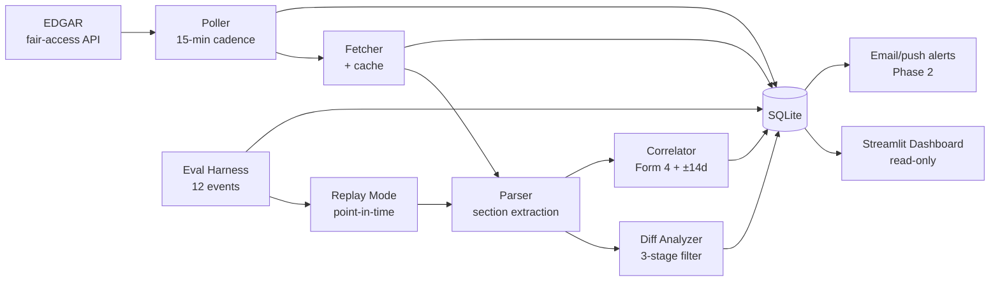

# ARCHITECTURE.md

System design reference for `redline`. Cross-referenced from `CLAUDE.md`. Section anchors are stable — reference by section number.

## §1 — System diagram



Side channels: the eval harness drives replay mode, which feeds historical filings through the same parser → diff → correlator pipeline. Writes from replay carry an `eval_run_id` to isolate them from live data in the same SQLite file.

## §2 — Subsystem 1: EDGAR poller

**Responsibility:** detect new filings on the watchlist.

**Inputs:**
- `config/watchlist.yaml` (8 CIKs)
- Last-seen accession number per CIK (from `filings_seen`)

**Outputs:**
- New `filings_seen` rows with `status = 'fetched'` (queued for the fetcher)

**State owned:** the cursor (last-seen accession per CIK). Nothing else.

**Cadence:** every 15 minutes. Implementation choice (cron, APScheduler, or `while True: sleep(900)`) deferred to Phase 1.

**Fair-access constraints (do not violate, per `NOTES.md` §4):**
- ≤ 10 requests/second across the whole process
- Descriptive `User-Agent`: `Redline (hatcher.ry@northeastern.edu)`
- Exponential backoff on HTTP 429 / 403 / 5xx (1s → 2s → 4s → ... cap 60s)
- Three consecutive backoff failures → log to `llm_call_log` (the general error sink for now) and skip the cycle

**Failure modes:**
- 403 from EDGAR (bad UA or rate violation): caught, logged, sleep 60s, retry once
- Network error: 3 retries with backoff, then skip cycle
- `edgartools` returns empty: not a failure, just "no new filings this cycle"

The poller is the only writer of new `filings_seen` rows during live operation. Replay mode bypasses it entirely (§12).

## §3 — Subsystem 2: Filing fetcher + parser

**Responsibility:** retrieve raw filing content and extract structured sections.

**Inputs:**
- `filings_seen` rows with `status = 'fetched'`

**Outputs:**
- `filings_content` row keyed by `accession`, containing extracted sections
- `filings_seen.status = 'parsed'`

**Library:** `edgartools`. See `NOTES.md` §5 for ingest quirks (filled during Phase 0.5).

**Section extraction:**

| Filing type | Sections extracted |
|---|---|
| 10-K | MD&A (Item 7), Risk Factors (Item 1A), Legal Proceedings (Item 3), QDMR (Item 7A) |
| 10-Q | MD&A (Item 2), Risk Factors (Item 1A — usually shorter), Legal Proceedings (Item 1), QDMR (Item 3) |
| 8-K | Item number + body text per item present (1.01, 2.01, 2.02, 5.02, 7.01, 8.01, …) |
| Form 4 | Transaction table (code, shares, price, date, ownership type) + Explanation of Responses |

**Empty-section handling:** common in Legal Proceedings ("see prior 10-K" or absent entirely). Stored as `text = NULL` plus an `is_empty` flag. Diff analyzer skips empty-to-empty transitions automatically.

**Caching:** every fetched filing's raw HTML is stored verbatim in `filings_content.raw_html` (compressed). Re-parsing during dev never re-fetches. Cache is invalidated only by an explicit `parser_version` bump.

**Failure modes:**
- Filing missing on EDGAR (rare): mark `parse_failed`, retry per §7
- Section regex fails (parser quirk): mark `parse_failed`, log section name
- Form 4 transaction parse error: log the specific transaction, continue with partial transactions

## §4 — Subsystem 3: Diff analyzer

**Responsibility:** detect substantive QoQ/YoY changes in MD&A, Risk Factors, Legal Proceedings, and QDMR. Suppress noise (boilerplate copy-paste, number-only changes, trivial edits).

**Default comparison strategy:** most-recent-same-type. A new 10-Q compares against the immediately prior 10-Q for the same issuer. A new 10-K compares against the prior 10-K. (Same-period prior year — Q3 vs prior Q3 — is an open question, see `ROADMAP.md` open questions.)

### Three-stage filter

**Stage 1 — Rule-based pre-filter (deterministic, no LLM).**

Two-step:

*Step 1a — Canonical-token normalization* (pre-diff). Replace volatile-but-cosmetic surface forms with stable canonical tokens BEFORE the diff is computed:
- Dates (`September 30, 2024`, `2024-09-30`, `Q3 2024`, etc.) → `<DATE>`
- Currency amounts (`$1.2 billion`, `$700,000`, `$.05`) → `<CURRENCY>`
- Percentages (`12.3%`, `12.3 percent`) → `<PCT>`
- Bare integers > 99 → `<INT>` (keeps small enumerators like "three" alone)

*Step 1b — Diff + rule filtering.* Run a paragraph- or sentence-level diff over the normalized text. Then drop:
- Whitespace-only changes and citation reformatting ("Item 1A" vs "Item 1A.")
- Changes shorter than N words (default `diff_min_words = 22`, configurable)
- Pure formatting deltas (HTML tag changes that survive parsing)

Output: list of `(section, old_chunk, new_chunk)` tuples that survived, with the canonical-token-normalized forms tracked alongside the original text (Stage 2/3 see the original for context).

*Reason:* most diffs are noise. The Q2-vs-Q3 manual diff (`NOTES.md` §1) showed that without normalization, ~50 cosmetic changes per filing would survive Stage 1 and burn Haiku budget at Stage 2 for nothing. Normalization first, threshold second.

**Stage 2 — Haiku gate ("is this substantive?").**
- Input: section name + old chunk + new chunk
- Output: `DiffGateDecision { substantive: bool, reason: str }`
- Model: Haiku
- Pass (`substantive = True`) → Stage 3
- Fail: log to `diff_results` with `gate_decision = 'not_substantive'` and `reason`; do not proceed

*Reason:* Risk Factors are sticky (`NOTES.md` §1). Many surviving Stage 1 changes are still boilerplate (counsel reword, structural moves). Haiku catches these at ~$0.001/call instead of paying Sonnet rates.

**Stage 3 — Sonnet summary.**
- Input: full section old + new, with the surviving chunks highlighted
- Output: `DiffSummary { change_type, materiality, summary, affected_topics }`
- Model: Sonnet
- Written to `diff_results`; if `materiality ≥ diff_materiality_threshold`, also contributes to a `flagged_events` row

*Reason:* by Stage 3, we believe the change is real and substantive. Sonnet's job is to characterize it well enough for the dashboard summary.

### Config knobs (in `settings.toml`)

- `diff_normalize_tokens` (default: `true`) — switches Step 1a canonical-token normalization on
- `diff_min_words` (default: `22` — candidate from Q2-vs-Q3 evidence in `NOTES.md` §1; final-lock 20 or 25 after the 10-K spike completes)
- `diff_number_only_skip` (default: `true`) — redundant once `diff_normalize_tokens` is on, but kept as a belt-and-suspenders override
- `diff_materiality_threshold` (default: `0.6` — `DiffSummary.materiality` is a 0–1 score)
- `diff_comparison_strategy` (default: `most_recent_same_type`)

## §5 — Subsystem 4: Insider-trading correlator

**Responsibility:** identify whether Form 4 transactions clustered near a filing event are anomalous, conditional on excluding plan-driven trades.

**Inputs:**
- A new filing event of any type other than Form 4 (triggers correlator)
- Form 4 transactions in `form4_transactions` for that issuer, in window

**Window:** ±14 days around the filing event date. Configurable as `correlator_window_days`.

**Outputs:**
- `flagged_events` row for the filing, with correlator metadata (anomaly verdict, contributing transactions, per-transaction plan-filter decisions)

### 10b5-1 plan filter (default-on)

Plan-driven transactions are excluded from anomaly calculation by default. Discretionary trades only.

**Detection logic:**
1. **Form 4 checkbox** — filed on/after **2023-04-01**. Trust these.
2. **Free-text "Explanation of Responses"** — for older Form 4s, or for the gap case below, parse for phrases like "10b5-1 plan adopted on [date]" or "pursuant to a Rule 10b5-1 trading plan." Extract plan adoption date when present.
3. **Pre-2023-02-27 plans** — the new checkbox doesn't apply to plans adopted before this date. A Form 4 filed in 2024 trading under a 2022 plan has the checkbox UNCHECKED even though the trade IS plan-driven. Mitigation: free-text fallback.
4. **Pre-April-2023 events accepted as noisier** for MVP. Logged in `NOTES.md` §2 and discussed in the README accuracy section.

### Anomaly score — three signals

**Combination formula is not yet committed.** Real Form 4 distributions must be inspected during the Phase 0.5 spike before any weighting or normalization scheme is locked. Each signal is defined below; the combination function is left open until then.

1. **Volume signal.** Transaction size vs. that insider's historical baseline. Baseline window is a tuneable parameter (`volume_baseline_window`) with **no committed default** — candidates include 6-month and 12-month trailing-per-insider with a fallback to an issuer-wide aggregate when the insider has < 3 historical trades. Excludes administrative codes (A, M, F — see `NOTES.md` §3) from the baseline.

2. **Direction-flip signal.** Did this insider's recent trade direction reverse their trailing pattern? A net-buyer over the prior window now executing a large sale (or vice versa). Combination of a boolean (flip happened) and a magnitude (how concentrated the reversal is).

3. **Multi-insider cluster signal.** Count of distinct insiders at the same issuer trading in the same direction within the ±14d window. A higher count is a stronger signal — correlated discretionary activity is rare under random 10b5-1 staggering.

All three raw signals are persisted to `flagged_events.correlator_payload` as structured JSON regardless of the combination formula, and the dashboard surfaces them individually. This preserves auditability when the formula is eventually committed and tuned.

### Sonnet reasoning layer

Above the numeric signals, a Sonnet call synthesizes:
- Whether the cluster looks discretionary or noise
- Which transactions are the main contributors
- A confidence score

Output: `CorrelatorVerdict { anomalous: bool, drivers: list[str], confidence: float }`.

## §6 — Subsystem 5: Dashboard + alerts

**Responsibility:** surface flagged events to the user.

**Implementation:** Streamlit.

**Default view:** last N flagged events from any time range, sorted by recency. Not "last 15 minutes" — empty dashboards demo badly. Filters: ticker, filing type, materiality threshold, has-correlator-flag.

**Per-event detail view:**
- Filing metadata (ticker, type, period, accession, EDGAR link)
- Diff summary (Stage 3 output, rendered)
- Stage 1 raw chunks (collapsed by default — for "show me what changed")
- Correlator output (raw signals + Sonnet verdict)
- Form 4 transactions in window (table, with plan-filter decisions visible)

**DB access:** read-only connection. Streamlit's auto-rerun model means many short reads. Set `PRAGMA query_only=ON` on the connection. No writes from the dashboard.

**Concurrency:** dashboard reads + poller writes against the same SQLite file. WAL mode (`PRAGMA journal_mode=WAL`) handles this. See `NOTES.md` §10.

### Alerts (Phase 2)

Out of scope for MVP. Architecture stub: a `notifier` interface that takes a `FlaggedEvent` and dispatches via configured channel (email / push / webhook). Provider unchosen. Trigger: a row appearing in `flagged_events` with `materiality_max >= alert_threshold` (threshold separate from the dashboard's display threshold so alerts can be louder).

## §7 — Status-driven pipeline state machine

Filings flow through statuses on `filings_seen.status`:

```
fetched → parsed → analyzed → flagged
   ↓        ↓         ↓
fetch_  parse_   analysis_
failed  failed   failed
   ↓        ↓         ↓
       failed_permanent
```

**Transitions:**
- `fetched` → `parsed`: fetcher succeeds, parser extracts sections
- `parsed` → `analyzed`: diff analyzer + correlator both complete
- `analyzed` → `flagged`: at least one materiality threshold cleared OR correlator anomalous
- `analyzed` (terminal, not flagged): subsystems ran, nothing notable surfaced
- Any stage → corresponding `*_failed`: with `last_attempted` timestamp and `failure_reason` string

**Retry semantics:**
- Each poll cycle, before checking for new filings: scan for rows in any `*_failed` status with `last_attempted < now - 1hr`
- Retry up to 3 times total per filing (tracked in `retry_count`)
- On the 3rd failure → `failed_permanent` and surfaced on the dashboard with a red badge

**Why this pattern:** decouples ingestion from analysis without separate worker processes. The poller IS the retry queue. No Celery / RQ / Redis required at this scale.

## §8 — End-to-end data flow (representative 10-Q)

1. **T+0:** Poller runs. PLTR has a new accession on EDGAR. Row inserted into `filings_seen` with `status = 'fetched'`.
2. **T+~0:** Fetcher pulls the raw filing via `edgartools`. `filings_content` row written with raw HTML + extracted sections. Status → `parsed`.
3. **T+~0:** Diff analyzer triggered. Looks up the prior PLTR 10-Q from `filings_content`. Stage 1 (rule-based) produces 47 surviving chunks. Stage 2 (Haiku) gates them — 41 marked non-substantive, 6 pass. Stage 3 (Sonnet) summarizes each of the 6, all written to `diff_results` with materiality scores.
4. **T+~0:** Correlator triggered. Queries `form4_transactions` for PLTR in the ±14d window. 9 transactions, 7 marked 10b5-1 (filtered out). 2 remaining discretionary. Volume / direction / cluster signals computed. Sonnet verdict synthesized → `correlator_payload`.
5. **T+~0:** Materiality check. 3 of 6 `diff_results` clear threshold; correlator flags anomalous. `flagged_events` row written. Status → `flagged`.
6. **T+~0:** Dashboard reload picks up the new flagged event. Alert (Phase 2) fires if configured.

Total latency target: < 2 min from EDGAR appearance to flagged event written. Dominated by Sonnet calls (3 × Stage 3 + 1 correlator ≈ 4 calls × ~20s).

## §9 — LLM call boundaries

Four call sites, each with a single Pydantic schema (defined in `src/redline/llm/schemas.py`):

| Call site | Model | Pydantic schema | Notes |
|---|---|---|---|
| Diff Stage 2 | Haiku | `DiffGateDecision` | One call per surviving Stage 1 chunk |
| Diff Stage 3 | Sonnet | `DiffSummary` | One call per Stage 2 pass, full-section context |
| Correlator | Sonnet | `CorrelatorVerdict` | One call per filing event (not per transaction) |
| Eval judge | Sonnet | `EvalJudgeVerdict` | Fallback when binary `pass_criteria` doesn't apply or is contradicted |

**Schema sketches:**

```
DiffGateDecision:
  substantive: bool
  reason: str                          # short — why or why not

DiffSummary:
  change_type: Literal['addition', 'removal', 'modification', 'restructure']
  materiality: float                   # 0–1
  summary: str                         # 1–3 sentences for dashboard
  affected_topics: list[str]           # e.g. ['deposits', 'capital_ratios']

CorrelatorVerdict:
  anomalous: bool
  drivers: list[str]                   # named transactions / patterns
  confidence: float                    # 0–1

EvalJudgeVerdict:
  passed: bool
  reasoning: str
  partial_credit: float                # 0–1 (for nuanced eval scoring)
```

**Prompt structure (all sites):**
- System message: role + output schema + tone constraints
- User message: structured input (section name, chunks, etc.)
- Prompt caching used for repeated context (e.g. the same prior filing across multiple Stage 3 calls in a batch)

**Versioning:** prompts in `config/prompts/<name>_v<n>.txt`. Cache key includes version. Bumping invalidates all cached outputs for that prompt.

## §10 — SQLite schema

Single DB at `data/redline.db`. WAL mode. Designed for clarity over micro-optimization — this is design, not migrations.

### `watchlist`
```
cik           TEXT PRIMARY KEY        -- EDGAR CIK, zero-padded 10-digit
ticker        TEXT NOT NULL
name          TEXT NOT NULL
sector        TEXT NOT NULL           -- tech | financials | healthcare | consumer
added_at      TIMESTAMP NOT NULL
```

### `filings_seen`
```
accession        TEXT PRIMARY KEY     -- EDGAR accession number
cik              TEXT NOT NULL REFERENCES watchlist(cik)
filing_type      TEXT NOT NULL        -- '10-K' | '10-Q' | '8-K' | '4'
period_end       DATE                 -- nullable (8-K, Form 4 have none)
filed_at         TIMESTAMP NOT NULL
status           TEXT NOT NULL        -- fetched | parsed | analyzed | flagged | *_failed | failed_permanent
last_attempted   TIMESTAMP
failure_reason   TEXT
retry_count      INTEGER NOT NULL DEFAULT 0
discovered_at    TIMESTAMP NOT NULL
eval_run_id      TEXT                 -- NULL for live, UUID during replay

INDEX (cik, filing_type, filed_at)
INDEX (status, last_attempted)        -- for retry-queue scan
```

### `filings_content`
```
accession        TEXT PRIMARY KEY REFERENCES filings_seen(accession)
raw_html         BLOB                 -- zlib-compressed raw filing
sections         JSON NOT NULL        -- {mdna, risk_factors, legal, qdmr} or {items: {...}} for 8-K
is_empty         JSON                 -- {risk_factors: bool, legal: bool, ...}
parser_version   TEXT NOT NULL        -- bump invalidates downstream caches
extracted_at     TIMESTAMP NOT NULL
```

### `form4_transactions`
```
id                  INTEGER PRIMARY KEY AUTOINCREMENT
accession           TEXT NOT NULL REFERENCES filings_seen(accession)
cik                 TEXT NOT NULL    -- issuer CIK
insider_cik         TEXT NOT NULL
insider_name        TEXT NOT NULL
trade_date          DATE NOT NULL
code                TEXT NOT NULL    -- P | S | A | M | F | …
shares              REAL NOT NULL
price               REAL             -- nullable for A, M
ownership           TEXT NOT NULL    -- 'D' direct | 'I' indirect
is_10b5_1           BOOLEAN          -- NULL when undetermined (pre-April-2023 ambiguous)
plan_adopted_date   DATE             -- extracted from free-text when present
explanation         TEXT             -- raw "Explanation of Responses"

INDEX (cik, trade_date)
INDEX (insider_cik, trade_date)
```

### `diff_results`
```
id                INTEGER PRIMARY KEY AUTOINCREMENT
accession         TEXT NOT NULL REFERENCES filings_seen(accession)
prior_accession   TEXT NOT NULL REFERENCES filings_seen(accession)
section           TEXT NOT NULL      -- mdna | risk_factors | legal | qdmr
stage             INTEGER NOT NULL   -- 1 | 2 | 3 — which stage produced this row
chunk_old         TEXT
chunk_new         TEXT
gate_decision     JSON               -- DiffGateDecision payload (when stage=2)
summary           JSON               -- DiffSummary payload (when stage=3)
materiality       REAL               -- 0–1, populated at stage 3
prompt_version    TEXT NOT NULL
created_at        TIMESTAMP NOT NULL
eval_run_id       TEXT

INDEX (accession, section, stage)
```

### `flagged_events`
```
id                  INTEGER PRIMARY KEY AUTOINCREMENT
accession           TEXT NOT NULL REFERENCES filings_seen(accession)
flag_reason         TEXT NOT NULL    -- 'diff_material' | 'correlator_anomaly' | 'both'
diff_summary        JSON             -- aggregated DiffSummary(s)
correlator_payload  JSON             -- CorrelatorVerdict + raw signals
materiality_max     REAL             -- max across diff_results for this filing
flagged_at          TIMESTAMP NOT NULL
eval_run_id         TEXT

INDEX (flagged_at)
INDEX (accession)
```

### `eval_runs`
```
id                   TEXT PRIMARY KEY    -- UUID
event_id             TEXT NOT NULL       -- references eval_events.yaml id
ran_at               TIMESTAMP NOT NULL
prompt_versions      JSON                -- {diff_gate: v1, diff_summary: v1, ...} snapshot
binary_result        BOOLEAN             -- pass_criteria outcome (NULL if not applicable)
judge_result         JSON                -- EvalJudgeVerdict (when applicable)
graded_pass          BOOLEAN NOT NULL    -- final pass/fail after hybrid grading
subsystems_tested    JSON                -- ['diff_analyzer', 'correlator', ...]
notes                TEXT
```

### `live_operation_log`
```
id                INTEGER PRIMARY KEY AUTOINCREMENT
accession         TEXT REFERENCES filings_seen(accession)
event_summary     TEXT NOT NULL        -- one-line description for demo "recent activity"
flagged_event_id  INTEGER REFERENCES flagged_events(id)
logged_at         TIMESTAMP NOT NULL
```

Separate from `eval_runs` to prevent fresh events from contaminating the graded eval. This is the "demo recent activity" surface only.

### `llm_call_log`
```
id              INTEGER PRIMARY KEY AUTOINCREMENT
called_at       TIMESTAMP NOT NULL
call_site       TEXT NOT NULL        -- diff_gate | diff_summary | correlator | eval_judge
model           TEXT NOT NULL        -- 'claude-haiku-4-5' | 'claude-sonnet-4-6' | ...
prompt_version  TEXT NOT NULL
tokens_in       INTEGER NOT NULL
tokens_out      INTEGER NOT NULL
cost_usd        REAL NOT NULL
latency_ms      INTEGER NOT NULL
cache_hit       BOOLEAN NOT NULL
status          TEXT NOT NULL        -- ok | parse_error | api_error | rate_limit
error_reason    TEXT

INDEX (called_at)
INDEX (call_site, called_at)
```

Cost discipline lives here. Weekly aggregation feeds `NOTES.md` §8.

## §11 — Eval harness

**Inputs:** `config/eval_events.yaml` — 12 entries, each with `id`, `ticker`, `filing_type`, `period`, `tests`, `pass_criteria`, `llm_judge_rubric`, `locked_at`.

**Execution model:** for each event, run replay mode (§12) at the appropriate historical timestamp, feed the target filing through only the tagged subsystems, capture outputs, then grade.

**Hybrid grading:**

1. **Binary first.** `pass_criteria` is a rule expressed in YAML (e.g. `"flagged_events.materiality_max >= 0.6 AND 'deposit' IN diff_summary.affected_topics"`). Evaluated against the run's outputs. If applicable and clearly pass/fail, that's the result.
2. **LLM-judge fallback.** When `pass_criteria` is too narrow to capture the spirit of the event, or when the binary result looks contradicted by inspection, the `llm_judge_rubric` text is fed to Sonnet alongside the run's outputs. Sonnet emits `EvalJudgeVerdict { passed, reasoning, partial_credit }`.
3. **Final `graded_pass`:** binary if available and not contradicted; else judge.

**Per-subsystem scoring:** events tagged `tests: [diff_analyzer]` count only toward `diff_analyzer`. Multi-tag events count toward each. Report per-subsystem **and** global (e.g. "diff_analyzer 5/8, correlator 2/3, parser 3/4, global 8/12").

**Honesty rules (locked):**
- A missed event is NEVER swapped out. Logged in `eval_runs` and discussed in the README.
- No fresh events added post-lock. Fresh events go to `live_operation_log`.
- `locked_at` in YAML is the receipt; the pre-registration commit is the proof.

## §12 — Replay mode

**Purpose:** run the pipeline against historical filings as if they were arriving in real time. Used by the eval harness AND for demoing past events.

**Design:** time-cursor advance. Given a `start_date` and `end_date`, walk EDGAR's historical filing index for the watchlist, treat each filing's `filed_at` as "now" for that step, and run the pipeline.

**Critical constraint:** the diff analyzer must NOT see filings that didn't exist at the simulated time. Prior-filing lookup uses `filings_content WHERE filed_at < simulated_now`. Same for the correlator (Form 4 transactions must satisfy `trade_date < simulated_now` AND `filings_seen.filed_at < simulated_now`).

**Code sharing with eval harness:** the eval harness IS replay mode plus grading. Same code path; the harness adds the per-event grading layer on top.

**Marker:** all DB writes during replay include `eval_run_id` (UUID). Live writes have `eval_run_id = NULL`. The dashboard filters by `eval_run_id IS NULL` for the default view.

## §13 — Configuration model

What lives where:

| Type | Location | Loaded via |
|---|---|---|
| Watchlist (8 tickers + CIKs) | `config/watchlist.yaml` | Pydantic model `Watchlist` |
| Eval events (12, with `locked_at`) | `config/eval_events.yaml` | Pydantic model list `EvalEvent` |
| Prompt templates (versioned text) | `config/prompts/<name>_v<n>.txt` | Pydantic wrapper `PromptTemplate { version, content, output_schema }` |
| Runtime settings (thresholds, weights, windows, polling cadence, model assignments) | `config/settings.toml` | `pydantic-settings` `RedlineConfig` |
| Pipeline state, content cache, transactions, results | `data/redline.db` | SQLite, via `storage/db.py` |
| Anthropic API key | `.env` (not committed) | `pydantic-settings` env loader |

**Watchlist YAML format:**
```yaml
- cik: "0001321655"
  ticker: PLTR
  name: Palantir Technologies Inc.
  sector: tech
- cik: "0001477333"
  ticker: NET
  name: Cloudflare Inc.
  sector: tech
# ... 6 more
```

CIK is authoritative; ticker is a label. Tickers can be reassigned over time; CIKs never are.

## §14 — Local-first deployment topology

**MVP (default):**
- Single host (Ian's machine)
- One Python process running the poller loop
- One Streamlit process for the dashboard
- Single SQLite file at `data/redline.db`
- Both processes connect to the same file; WAL mode handles concurrent reader + writer

**Hosted variants (Phase 2, only if earned):**

*Option A — VPS + Turso (libSQL):*
- Linux VPS (~$5/mo) running the poller as a systemd service
- Turso for hosted SQLite-compatible DB (replicas + auth)
- Streamlit Cloud serving the dashboard, connecting to Turso

*Option B — Streamlit Cloud + GitHub Actions cron:*
- GH Actions workflow runs poller every 15 min (cron)
- Writes to a Turso DB or a small managed Postgres
- Streamlit Cloud reads from same DB

Option A is simpler operationally; Option B is cheaper and uses no VPS. Defer the choice to Phase 2, with real cost numbers in hand.

**Things that would change going hosted:**
- Replace local SQLite file paths with a connection string in config
- Add a health-check endpoint to the poller (HTTP 200 if last cycle < 30 min ago)
- Move secrets to proper secret management (Streamlit Cloud / Actions secrets / VPS env file)
- Migrate `data/` content (filing HTML cache) — either Turso BLOB columns or a detached S3 bucket
