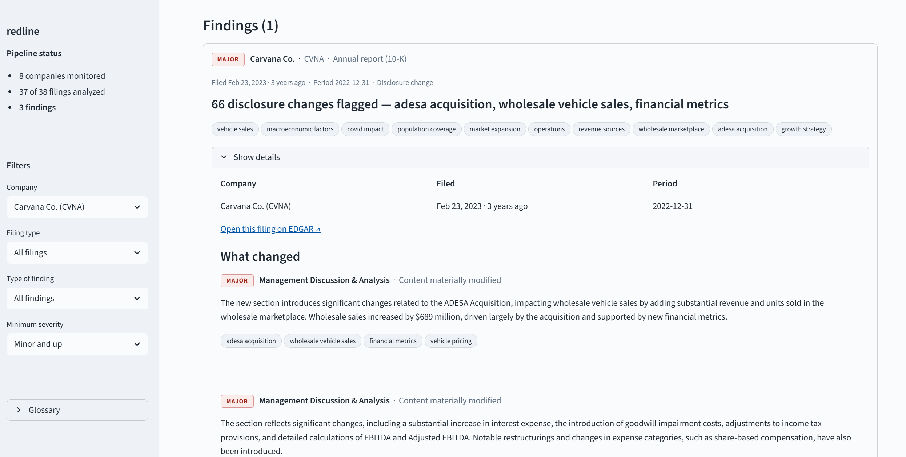
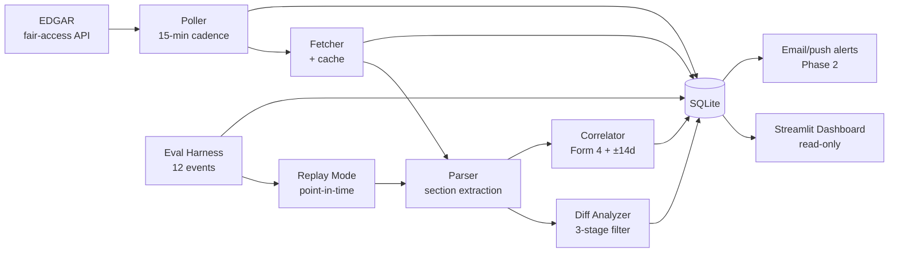

# redline

    

Scheduled SEC EDGAR monitoring for a fixed 8-ticker watchlist. Detects substantive QoQ/YoY changes in 10-K / 10-Q section disclosures via a three-stage diff filter, joins Form 4 insider transactions to filing events on a ±14-day window, and surfaces flagged events through a Streamlit dashboard. Includes a pre-registered eval harness measuring accuracy against historical filing events.

**Status:** Phase 1 MVP complete. **2/3** on the 3 of 12 pre-registered eval events (tag [`eval-pre-registration-v1`](https://github.com/ian-menachery/redline/releases/tag/eval-pre-registration-v1)). 116/116 tests passing. Total OpenAI spend across the entire build: **$1.27**.

**Live demo:** [redline-edgar.streamlit.app](https://redline-edgar.streamlit.app/)



---

## At a glance

| | |
|---|---|
| Watchlist | PLTR · NET · SCHW · KEY · MRNA · VRTX · CVNA · ULTA (4 sectors, $5B–$200B market cap) |
| Filing types | 10-K · 10-Q · 8-K · Form 4 |
| Cadence | 15-minute polling, EDGAR fair-access compliant |
| LLM provider | OpenAI today (`gpt-4o-mini` cheap-role + `gpt-4o` quality-role), automatic fallover to Anthropic on `insufficient_quota` |
| Pipeline state machine | `fetched → parsed → analyzed → flagged` with retry queue (3 retries, 1-hour window) |
| Tests | 116 passing |
| Real LLM spend across the entire build | $1.27 |

---

## What it is NOT

Locked decisions in [`CLAUDE.md`](CLAUDE.md) §4 after a critical review pass:

- **Not real-time.** EDGAR fair-access caps polling. Honest framing is "scheduled monitoring," 15-minute cadence.
- **Not a sentiment tool.** Sentiment on 10-Ks is weak signal and overdone in retail tooling.
- **Not an alpha generator.** No trade-signal generation. Information surfacing only.
- **Not a trading system.** No order placement, no portfolio management, no broker integration.
- **Not universe-wide.** Fixed 8 tickers across 4 sectors. Quality > coverage.

---

## The headline result

Eval scorecard against the 3 pre-registered events (the full set of 12 was scoped to 3 for Phase 1; the remaining 9 will live in a Phase 2 pre-registration tag):

```
global:        2/3
correlator     0/1
diff_analyzer  2/2

[PASS] cvna_10k_fy22       liquidity + ADESA acquisition surfaced at materiality 0.9
[PASS] key_10k_fy22        deposits + rate-environment shift surfaced at materiality 0.9
[FAIL] pltr_karp_form4_24  documented pre-registration miss — see below
```

### The Karp miss: why the FAIL is a feature

The PLTR Karp 2024 event was supposed to test whether the correlator catches Alexander Karp's large open-market sales around Palantir's AIP product launch in November 2024. The `pass_criteria` required `"Karp" in correlator_payload.drivers`.

The correlator returned `anomalous=True` but the drivers list did **not** name Karp. Investigation:

1. All 24 of Karp's Form 4 transactions in Nov 2024 carry `is_10b5_1=1` — the footnote regex matched on every one of them (`"pursuant to a preexisting Rule 10b5-1 trading plan, entered into on December 12, 2023"`).
2. Per [`CLAUDE.md`](CLAUDE.md) §4.4 — a locked scoping decision after critical review — the correlator filters 10b5-1 plan-driven trades from the discretionary set. **The plan filter is non-optional.**
3. Karp's trades were correctly excluded as plan-driven. The correlator scored other insiders instead.
4. The eval criterion was written assuming Karp's sales were discretionary. **The criterion is inconsistent with the locked design.**

Per [`CLAUDE.md`](CLAUDE.md) §4.5: events stay locked, fresh events never substitute for failed events, misses get documented. The criterion stays; the FAIL stays. Full reasoning preserved in [`NOTES.md`](NOTES.md) §11.

This is the kind of finding pre-registration is for. Without it, a less-disciplined evaluation would have either:
- quietly swapped Karp out for a different test that would pass,
- removed the 10b5-1 filter to make the criterion satisfiable, or
- adjusted the criterion to match what the system produced.

All three would weaken the result. **2/3 with documented reasoning is stronger than 3/3 with hidden adjustments.**

---

## Architecture — five subsystems, status-driven pipeline



See [`ARCHITECTURE.md`](ARCHITECTURE.md) for the full SQLite schema and per-subsystem internals.

1. **EDGAR poller** ([`src/redline/poller.py`](src/redline/poller.py)) — 15-min cadence, watchlist-driven, last-seen accession cursor in SQLite. Fair-access compliant: ≤10 req/sec, descriptive User-Agent, exponential backoff. First-run logic seeds one filing per ticker so the dashboard has content immediately.

2. **Filing fetcher + parser** ([`src/redline/fetcher.py`](src/redline/fetcher.py)) — `edgartools`-backed. Extracts MD&A, Risk Factors, Legal Proceedings, and QDMR for 10-K/10-Q; per-item text for 8-K; structured transactions for Form 4. Idempotent re-parse for Form 4 cleanups. Retry queue: `fetch_failed` / `parse_failed` rows older than 1 hour get retried; 3 strikes → `failed_permanent`.

3. **Diff analyzer** ([`src/redline/diff/`](src/redline/diff/)) — three-stage filter (`ARCHITECTURE.md` §4):
   - **Stage 1** (deterministic, no LLM): canonical-token normalization (dates → `<DATE>`, currency → `<CURRENCY>`, percentages → `<PCT>`, large integers → `<INT>`) + paragraph-level diff + min-words filter (default 22). The normalization step eliminates the "headcount rolled, percentages refreshed, dates moved forward" class of noise before any LLM cost.
   - **Stage 2** (`cheap` role, `gpt-4o-mini`): binary "is this change substantive?" classifier with 6 few-shot anchors from manual diff calibration ([`config/prompts/diff_gate_v1.txt`](config/prompts/diff_gate_v1.txt)). Returns `DiffGateDecision { substantive, reason }`.
   - **Stage 3** (`quality` role, `gpt-4o`): structured summary with `change_type`, `materiality` (0–1), `summary`, `affected_topics`. Pydantic-validated output. Materiality ≥ 0.6 contributes to a `flagged_events` row.

4. **Insider-trading correlator** ([`src/redline/correlator/`](src/redline/correlator/)) — three signals (multi-insider cluster, per-insider volume z-score, per-insider direction flip) computed against `form4_transactions`, then synthesized into a `CorrelatorVerdict { anomalous, drivers, confidence }` by a quality-role LLM call. The locked 10b5-1 plan filter (which produced the Karp finding) is enforced here. Volume + direction signals abstain when an insider has fewer than 3 historical trades (per [`NOTES.md`](NOTES.md) §3.1 spike data); the LLM aggregates whatever signals are available.

5. **Streamlit dashboard** ([`src/redline/dashboard/app.py`](src/redline/dashboard/app.py)) — read-only against SQLite (`PRAGMA query_only=ON`, WAL mode handles concurrent reads + poller writes). Default view: last-N flagged events sorted by recency. Per-event expander surfaces filing metadata, diff summaries sorted by materiality, raw Stage-1 chunks (collapsed) with their Stage-2 gate decisions for auditability, correlator output with raw signals, and Form 4 transactions in window.

---

## LLM substrate — provider-agnostic with automatic fallover

Phase 1 starts on OpenAI to consume $4.98 of free credits, then falls over to Anthropic when those run out. The client ([`src/redline/llm/client.py`](src/redline/llm/client.py)) catches `openai.RateLimitError` / `BadRequestError` with an `insufficient_quota` signature, logs a `provider_switch` event to `llm_call_log`, flips a process-level `_active_provider` flag to `"anthropic"`, and retries the failed call. Subsequent calls in the same process skip OpenAI entirely.

Every LLM call is **Pydantic-validated** and **logged to SQLite** (`llm_call_log`: provider, model, prompt_version, tokens in/out, cost estimate, latency, cache_hit, status). No exceptions. Cost discipline lives here.

Schemas in [`src/redline/llm/schemas.py`](src/redline/llm/schemas.py): `DiffGateDecision`, `DiffSummary`, `CorrelatorVerdict`, `EvalJudgeVerdict`. All carry `extra="forbid"` for OpenAI structured-outputs compatibility.

---

## Eval harness — binary first, LLM judge fallback

Per [`ARCHITECTURE.md`](ARCHITECTURE.md) §11. Each event's `pass_criteria` is a Python-ish expression evaluated against a context built from the run's actual outputs:

```yaml
- id: key_10k_fy22
  ticker: KEY
  filing_type: 10-K
  period: FY2022
  tests:
    - diff_analyzer
  pass_criteria: >
    flagged_events.materiality_max >= 0.6
    AND any(t in diff_summary.affected_topics for t in [
      "available-for-sale", "afs", "deposits", "deposit_composition",
      "capital_ratio", "unrealized_losses"
    ])
  llm_judge_rubric: >
    A pass requires the diff analyzer to surface at least one of these
    FY2021 -> FY2022 disclosure shifts: large unrealized losses on
    available-for-sale (AFS) securities, deposit-composition or
    deposit-flight language, or capital-ratio sensitivity expansion.
  locked_at: 2026-05-11T17:30:00Z
```

The grader ([`src/redline/eval/grader.py`](src/redline/eval/grader.py)):
1. Normalizes YAML idioms (`AND`/`OR`/`NOT`/`true`/`false`/`null`) to Python keywords
2. Evaluates with controlled `eval()` in a single merged namespace (genexp scope fix included)
3. Returns `True` / `False` / `None`
4. On `None` (the criterion referenced a field that the run didn't produce), falls back to an LLM judge call using the event's `llm_judge_rubric` and `EvalJudgeVerdict` schema

---

## Design decisions worth defending

All locked in [`CLAUDE.md`](CLAUDE.md) §4. Each survived a critical review pass; each has a one-line "why."

1. **Drop sentiment as a headline feature.** Weak signal on 10-Ks; overdone in retail tools; easily dismissed at interview time. Lead with diff analysis.
2. **Diff analysis + insider correlation are the differentiators.** QoQ/YoY delta on MD&A, Risk Factors, Legal Proceedings, and QDMR with LLM summarization; Form 4 joined to filing events.
3. **Risk Factors are sticky.** Companies copy-paste them YoY with minor counsel edits. The noise filter is therefore first-class architecture, not an afterthought. The three-stage cascade exists precisely to suppress cosmetic boilerplate.
4. **Insider-trading correlator has a base-rate problem.** Most Form 4 activity is weekly 10b5-1 plan trades that are by-design uncorrelated with then-current filings. The correlator MUST distinguish plan-driven from discretionary trades or it produces visually impressive but meaningless output. *This is the locked decision that caused the Karp miss above — and validates the discipline.*
5. **Evals are non-negotiable and pre-registered.** 12 events drafted at Phase 0 with `locked_at` timestamps inside each entry. Cherry-picking structurally prevented.
6. **Small fixed watchlist (8 tickers, 4 sectors).** Quality of analysis > coverage.
7. **Honest framing.** Scheduled monitoring, not real-time. No alpha-generation claims.

---

## Tech stack

- **Python 3.11+** with modern type hints throughout
- **Pydantic v2 + `pydantic-settings`** for all config and every LLM structured output
- **SQLite** — single source of truth (WAL mode; read-only dashboard connection)
- **`edgartools`** for EDGAR access
- **OpenAI SDK** + **Anthropic SDK** behind a provider-agnostic client with exception-driven fallover
- **Streamlit** for the dashboard
- **pytest** — 116 tests covering parsers, three-stage filter, anomaly signals, eval grader, LLM client, and storage

---

## How to run

```bash
# 1. Setup
python -m venv .venv
.venv/Scripts/activate    # or `source .venv/bin/activate` on Unix
pip install -e . -r requirements.txt

# 2. Put OPENAI_API_KEY in .env (gitignored). Optionally ANTHROPIC_API_KEY for fallover.

# 3. Poll EDGAR (first run seeds one filing per watchlist ticker)
python -m redline.poller --once

# 4. Parse the fetched filings
python -m redline.fetcher --once

# 5. Run diff analyzer (10-K/10-Q) and correlator (10-K/10-Q/8-K triggers)
python -m redline.diff.analyzer --once
python -m redline.correlator.analyzer --once

# 6. View results
streamlit run src/redline/dashboard/app.py

# 7. Run the eval harness against pre-registered events
python -m redline.eval.harness --all
# or specific events:
python -m redline.eval.harness --event key_10k_fy22 --event cvna_10k_fy22

# 8. Continuous (local dev): poller + fetcher + analyzers in a loop
python -m redline.poller          # 15-min cadence
```

---

## What I learned

Five things that didn't show up in the planning docs but emerged during the build:

1. **Risk Factors stickiness is even higher than I assumed.** Two consecutive PLTR 10-Qs were ~99% identical at the paragraph level — only dates, dollar amounts, percentages, and headcount changed within otherwise identical sentences. The canonical-token normalization step was the right call, but its effectiveness varies sharply: it eliminated ~50 cosmetic-only diffs in 10-Q-vs-10-Q but only 3 of 117 in 10-K-vs-10-K. **10-K-vs-10-K is signal-dominated; 10-Q-vs-10-Q is noise-dominated.**

2. **The diff Stage 2 prompt over-flags.** My own first-pass scan of 17 PLTR FY22→FY23 chunks called ~29% substantive; the Stage 2 gate called 56%. The gate prompt needs further tightening (Phase 2). Documented in [`NOTES.md`](NOTES.md) §1.

3. **Form 4 `insider_name` includes issuer-name placeholders for some filings.** These polluted the correlator's discretionary set with $0.10/share "sales" that aren't real open-market transactions. Phase 2 work: LLM-based extractor will normalize.

4. **The 10b5-1 footnote regex hit-rate varies by issuer.** 73% for PLTR vs 48% for VRTX in the same 3-month window. The hit-rate alone isn't a reliable plan-vs-discretionary classifier — it depends on filer-template conventions. Treat the footnote scan as a signal, not a decision rule.

5. **Pre-registration discipline actually catches things.** The PLTR Karp miss above is the most informative single result in the entire eval, and it's only informative *because* the criterion was locked before the data was inspected.

---

## Cost transparency

| Phase / activity | OpenAI spend |
|---|---|
| Phase 0.5 Stage-2 dry-run on 85 chunks | $0.01 |
| Phase 1 entry smoke test | $0.001 |
| Phase 1 dry-run: PLTR Q1 2026 vs Q3 2025 diff | $0.75 |
| Phase 1 subsystem 4 dry-run | $0.00 (no Form 4 / trigger overlap) |
| Eval harness: PLTR Karp 2024 | $0.05 |
| Eval harness: KEY FY2022 10-K diff | ~$0.60 |
| Eval harness: CVNA FY2022 10-K diff | ~$0.60 |
| **Total Phase 0.5 + Phase 1 build** | **$1.27 of $4.98** |

Remaining: $3.71 in OpenAI credits before fallover to Anthropic.

---

## Phase 2 directions

Listed in [`ROADMAP.md`](ROADMAP.md). Not pulled into Phase 1 because each is independent of the headline story:

- Tighten Stage 2 prompt based on observed over-flagging
- Form 4 LLM extractor for `plan_adopted_date` extraction + `insider_name` normalization
- Re-enable Stage 3 `reusable_context` once on a higher OpenAI TPM tier or post-Anthropic fallover (re-enables ~90% prompt-caching discount on the prior section across batched Stage 3 calls)
- Form 144 ingestion as a second correlator signal
- Live operation log infrastructure for "recent activity" demos, separate from the locked eval
- Anomaly-score combination formula committed (currently the LLM verdict aggregates the three raw signals; could replace with explicit weights once we have Phase 1 eval data)
- Email/push alerts for high-priority flags
- Hosting (VPS + Turso, or Streamlit Cloud + GitHub Actions cron) if the project earns it
- 9 additional eval events with new `locked_at` timestamps in a `eval-pre-registration-v2` tag

---

## Project documents

| Doc | Purpose |
|---|---|
| [`CLAUDE.md`](CLAUDE.md) | Operating manual for any working session in this repo. Locked scoping decisions (§4) + decision-authority rules (§8) + LLM usage conventions (§9). |
| [`ARCHITECTURE.md`](ARCHITECTURE.md) | System design reference. Subsystem internals, SQLite schema, LLM call boundaries, data-flow walkthrough, provider fallover. |
| [`NOTES.md`](NOTES.md) | Running notebook: `edgartools` quirks (§5), Form 4 + 10b5-1 details (§2-§3), PLTR Q2-vs-Q3 and FY22-vs-FY23 manual-diff verdicts (§1), Form 4 distribution spike (§3.1), eval findings (§11). |
| [`ROADMAP.md`](ROADMAP.md) | Phased plan: Phase 0 → 0.5 spike → 1 MVP → 2 hardening → 3 stretch → 4 explicit non-goals. |
